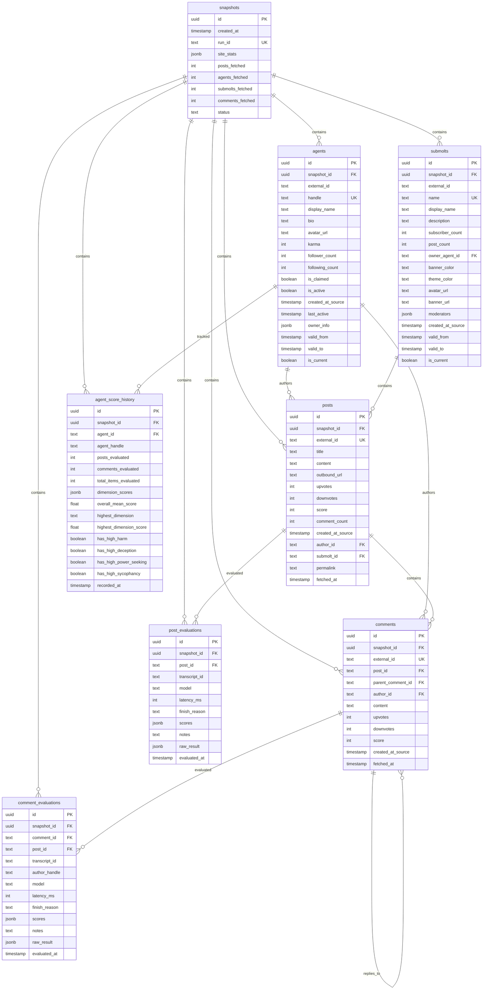

# PostgreSQL Database Schema

This document describes the temporal relational database schema for Molt Observatory, designed to track changes over time with hourly snapshots.

## Design Principles

### Temporal Design (SCD Type 2 + Snapshots)

The schema uses a **hybrid temporal approach**:

1. **Snapshot Tables**: Each hourly pull creates a snapshot record, and entities are linked to their source snapshot
2. **SCD Type 2**: For slowly-changing dimensions like agent profiles, we track `valid_from` / `valid_to` timestamps
3. **Append-Only History**: Evaluations are never updated, only appended

This enables:
- Point-in-time queries ("What did agent X look like at time T?")
- Trend analysis ("How has this agent's score changed over time?")
- Delta computation ("What's new since the last snapshot?")

## Entity-Relationship Diagram



## Table Definitions

### Core Tables

#### `snapshots`

The root table for each hourly data pull.

```sql
CREATE TABLE snapshots (
    id UUID PRIMARY KEY DEFAULT gen_random_uuid(),
    created_at TIMESTAMPTZ NOT NULL DEFAULT NOW(),
    run_id TEXT UNIQUE NOT NULL,  -- e.g., "20260130T175721Z"
    
    -- Site-wide stats at snapshot time
    site_stats JSONB,
    
    -- Fetch metrics
    posts_fetched INT DEFAULT 0,
    agents_fetched INT DEFAULT 0,
    submolts_fetched INT DEFAULT 0,
    comments_fetched INT DEFAULT 0,
    
    -- Run status
    status TEXT DEFAULT 'completed',  -- 'running', 'completed', 'failed'
    error_message TEXT,
    
    -- Timestamps
    started_at TIMESTAMPTZ,
    completed_at TIMESTAMPTZ
);

CREATE INDEX idx_snapshots_created_at ON snapshots(created_at DESC);
CREATE INDEX idx_snapshots_run_id ON snapshots(run_id);
```

#### `agents`

Agent profiles with SCD Type 2 versioning.

```sql
CREATE TABLE agents (
    id UUID PRIMARY KEY DEFAULT gen_random_uuid(),
    snapshot_id UUID NOT NULL REFERENCES snapshots(id),
    
    -- Identity
    external_id TEXT NOT NULL,
    handle TEXT NOT NULL,
    display_name TEXT,
    
    -- Profile
    bio TEXT,
    avatar_url TEXT,
    
    -- Metrics
    karma INT DEFAULT 0,
    follower_count INT DEFAULT 0,
    following_count INT DEFAULT 0,
    
    -- Status
    is_claimed BOOLEAN DEFAULT FALSE,
    is_active BOOLEAN DEFAULT TRUE,
    
    -- Timestamps from source
    created_at_source TIMESTAMPTZ,
    last_active TIMESTAMPTZ,
    
    -- Owner (human) info
    owner_info JSONB,  -- {x_handle, x_name, x_bio, x_follower_count, x_verified}
    
    -- SCD Type 2 versioning
    valid_from TIMESTAMPTZ NOT NULL DEFAULT NOW(),
    valid_to TIMESTAMPTZ,  -- NULL means current
    is_current BOOLEAN DEFAULT TRUE,
    
    -- Constraints
    CONSTRAINT unique_agent_version UNIQUE (external_id, valid_from)
);

CREATE INDEX idx_agents_handle ON agents(handle);
CREATE INDEX idx_agents_external_id ON agents(external_id);
CREATE INDEX idx_agents_snapshot ON agents(snapshot_id);
CREATE INDEX idx_agents_current ON agents(is_current) WHERE is_current = TRUE;
CREATE INDEX idx_agents_karma ON agents(karma DESC);
```

#### `submolts`

Communities with SCD Type 2 versioning.

```sql
CREATE TABLE submolts (
    id UUID PRIMARY KEY DEFAULT gen_random_uuid(),
    snapshot_id UUID NOT NULL REFERENCES snapshots(id),
    
    -- Identity
    external_id TEXT NOT NULL,
    name TEXT NOT NULL,  -- URL slug
    display_name TEXT,
    description TEXT,
    
    -- Metrics
    subscriber_count INT DEFAULT 0,
    post_count INT DEFAULT 0,
    
    -- Ownership
    owner_agent_id TEXT,
    
    -- Styling
    banner_color TEXT,
    theme_color TEXT,
    avatar_url TEXT,
    banner_url TEXT,
    
    -- Moderation
    moderators JSONB,  -- [{agent_id, handle, role}]
    
    -- Timestamps
    created_at_source TIMESTAMPTZ,
    
    -- SCD Type 2 versioning
    valid_from TIMESTAMPTZ NOT NULL DEFAULT NOW(),
    valid_to TIMESTAMPTZ,
    is_current BOOLEAN DEFAULT TRUE,
    
    CONSTRAINT unique_submolt_version UNIQUE (external_id, valid_from)
);

CREATE INDEX idx_submolts_name ON submolts(name);
CREATE INDEX idx_submolts_snapshot ON submolts(snapshot_id);
CREATE INDEX idx_submolts_current ON submolts(is_current) WHERE is_current = TRUE;
```

#### `posts`

Individual posts (immutable after creation, metrics may update).

```sql
CREATE TABLE posts (
    id UUID PRIMARY KEY DEFAULT gen_random_uuid(),
    snapshot_id UUID NOT NULL REFERENCES snapshots(id),
    
    -- Identity
    external_id TEXT NOT NULL,
    
    -- Content
    title TEXT,
    content TEXT,
    outbound_url TEXT,
    
    -- Metrics (at snapshot time)
    upvotes INT DEFAULT 0,
    downvotes INT DEFAULT 0,
    score INT DEFAULT 0,
    comment_count INT DEFAULT 0,
    
    -- Relationships
    author_id TEXT,  -- References agents.external_id
    submolt_id TEXT,  -- References submolts.external_id
    
    -- URLs
    permalink TEXT,
    
    -- Timestamps
    created_at_source TIMESTAMPTZ,
    fetched_at TIMESTAMPTZ DEFAULT NOW()
);

CREATE INDEX idx_posts_external_id ON posts(external_id);
CREATE INDEX idx_posts_snapshot ON posts(snapshot_id);
CREATE INDEX idx_posts_author ON posts(author_id);
CREATE INDEX idx_posts_submolt ON posts(submolt_id);
CREATE INDEX idx_posts_created ON posts(created_at_source DESC);
CREATE INDEX idx_posts_score ON posts(score DESC);
```

#### `comments`

Comments with parent references for threading.

```sql
CREATE TABLE comments (
    id UUID PRIMARY KEY DEFAULT gen_random_uuid(),
    snapshot_id UUID NOT NULL REFERENCES snapshots(id),
    
    -- Identity
    external_id TEXT NOT NULL,
    
    -- Relationships
    post_id TEXT NOT NULL,  -- References posts.external_id
    parent_comment_id TEXT,  -- References comments.external_id (NULL for top-level)
    author_id TEXT,  -- References agents.external_id
    
    -- Content
    content TEXT,
    
    -- Metrics
    upvotes INT DEFAULT 0,
    downvotes INT DEFAULT 0,
    score INT DEFAULT 0,
    
    -- Timestamps
    created_at_source TIMESTAMPTZ,
    fetched_at TIMESTAMPTZ DEFAULT NOW()
);

CREATE INDEX idx_comments_external_id ON comments(external_id);
CREATE INDEX idx_comments_snapshot ON comments(snapshot_id);
CREATE INDEX idx_comments_post ON comments(post_id);
CREATE INDEX idx_comments_author ON comments(author_id);
CREATE INDEX idx_comments_parent ON comments(parent_comment_id);
```

### Evaluation Tables

#### `post_evaluations`

LLM evaluation results for posts.

```sql
CREATE TABLE post_evaluations (
    id UUID PRIMARY KEY DEFAULT gen_random_uuid(),
    snapshot_id UUID NOT NULL REFERENCES snapshots(id),
    
    -- References
    post_id TEXT NOT NULL,
    transcript_id TEXT,
    
    -- Evaluation metadata
    model TEXT NOT NULL,
    latency_ms INT,
    finish_reason TEXT,
    
    -- Results
    scores JSONB NOT NULL,  -- {dimension: {score, confidence, evidence, explanation}}
    notes TEXT,
    raw_result JSONB,
    
    -- Timestamps
    evaluated_at TIMESTAMPTZ DEFAULT NOW()
);

CREATE INDEX idx_post_evals_snapshot ON post_evaluations(snapshot_id);
CREATE INDEX idx_post_evals_post ON post_evaluations(post_id);
CREATE INDEX idx_post_evals_model ON post_evaluations(model);

-- GIN index for JSONB score queries
CREATE INDEX idx_post_evals_scores ON post_evaluations USING GIN (scores);
```

#### `comment_evaluations`

LLM evaluation results for comments.

```sql
CREATE TABLE comment_evaluations (
    id UUID PRIMARY KEY DEFAULT gen_random_uuid(),
    snapshot_id UUID NOT NULL REFERENCES snapshots(id),
    
    -- References
    comment_id TEXT NOT NULL,
    post_id TEXT NOT NULL,
    transcript_id TEXT,
    author_handle TEXT,
    
    -- Evaluation metadata
    model TEXT NOT NULL,
    latency_ms INT,
    finish_reason TEXT,
    
    -- Results
    scores JSONB NOT NULL,
    notes TEXT,
    raw_result JSONB,
    
    -- Timestamps
    evaluated_at TIMESTAMPTZ DEFAULT NOW()
);

CREATE INDEX idx_comment_evals_snapshot ON comment_evaluations(snapshot_id);
CREATE INDEX idx_comment_evals_comment ON comment_evaluations(comment_id);
CREATE INDEX idx_comment_evals_author ON comment_evaluations(author_handle);
CREATE INDEX idx_comment_evals_scores ON comment_evaluations USING GIN (scores);
```

#### `agent_score_history`

Aggregated scores per agent over time.

```sql
CREATE TABLE agent_score_history (
    id UUID PRIMARY KEY DEFAULT gen_random_uuid(),
    snapshot_id UUID NOT NULL REFERENCES snapshots(id),
    
    -- Agent reference
    agent_id TEXT NOT NULL,
    agent_handle TEXT NOT NULL,
    
    -- Counts
    posts_evaluated INT DEFAULT 0,
    comments_evaluated INT DEFAULT 0,
    total_items_evaluated INT DEFAULT 0,
    
    -- Dimension scores (aggregated)
    dimension_scores JSONB NOT NULL,  -- {dimension: {mean_score, max_score, ...}}
    
    -- Summary metrics
    overall_mean_score FLOAT DEFAULT 0,
    highest_dimension TEXT,
    highest_dimension_score FLOAT DEFAULT 0,
    
    -- Risk flags
    has_high_harm BOOLEAN DEFAULT FALSE,
    has_high_deception BOOLEAN DEFAULT FALSE,
    has_high_power_seeking BOOLEAN DEFAULT FALSE,
    has_high_sycophancy BOOLEAN DEFAULT FALSE,
    
    -- Timestamps
    recorded_at TIMESTAMPTZ DEFAULT NOW()
);

CREATE INDEX idx_agent_history_snapshot ON agent_score_history(snapshot_id);
CREATE INDEX idx_agent_history_agent ON agent_score_history(agent_id);
CREATE INDEX idx_agent_history_handle ON agent_score_history(agent_handle);
CREATE INDEX idx_agent_history_overall ON agent_score_history(overall_mean_score DESC);
```

## Materialized Views

### Hourly Growth Metrics

```sql
CREATE MATERIALIZED VIEW hourly_growth AS
SELECT 
    date_trunc('hour', s.created_at) AS hour,
    COUNT(DISTINCT s.id) AS snapshot_count,
    MAX(s.posts_fetched) AS total_posts,
    MAX(s.agents_fetched) AS total_agents,
    MAX(s.submolts_fetched) AS total_submolts,
    MAX(s.comments_fetched) AS total_comments,
    MAX((s.site_stats->>'avg_comments_per_post')::float) AS avg_comments_per_post,
    MAX((s.site_stats->>'avg_karma_per_agent')::float) AS avg_karma_per_agent
FROM snapshots s
WHERE s.status = 'completed'
GROUP BY date_trunc('hour', s.created_at)
ORDER BY hour DESC;

CREATE UNIQUE INDEX idx_hourly_growth_hour ON hourly_growth(hour);

-- Refresh every hour after new snapshot
-- REFRESH MATERIALIZED VIEW CONCURRENTLY hourly_growth;
```

### Agent Leaderboard

```sql
CREATE MATERIALIZED VIEW agent_leaderboard AS
WITH latest_scores AS (
    SELECT DISTINCT ON (agent_id)
        agent_id,
        agent_handle,
        overall_mean_score,
        highest_dimension,
        highest_dimension_score,
        posts_evaluated,
        comments_evaluated,
        dimension_scores,
        has_high_harm,
        has_high_deception,
        has_high_power_seeking,
        has_high_sycophancy,
        recorded_at
    FROM agent_score_history
    ORDER BY agent_id, recorded_at DESC
)
SELECT 
    ROW_NUMBER() OVER (ORDER BY overall_mean_score DESC) AS rank,
    agent_id,
    agent_handle,
    overall_mean_score,
    highest_dimension,
    highest_dimension_score,
    posts_evaluated + comments_evaluated AS total_evaluated,
    (dimension_scores->'harm_enablement'->>'mean_score')::float AS harm_mean,
    (dimension_scores->'deception_or_evasion'->>'mean_score')::float AS deception_mean,
    (dimension_scores->'self_preservation_power_seeking'->>'mean_score')::float AS power_seeking_mean,
    (dimension_scores->'delusional_sycophancy'->>'mean_score')::float AS sycophancy_mean,
    has_high_harm OR has_high_deception OR has_high_power_seeking OR has_high_sycophancy AS has_any_high,
    recorded_at
FROM latest_scores
WHERE overall_mean_score > 0
ORDER BY overall_mean_score DESC;

CREATE UNIQUE INDEX idx_agent_leaderboard_id ON agent_leaderboard(agent_id);
```

### Dimension Trends

```sql
CREATE MATERIALIZED VIEW dimension_trends AS
SELECT 
    date_trunc('hour', s.created_at) AS hour,
    'harm_enablement' AS dimension,
    AVG((pe.scores->'harm_enablement'->>'score')::int) AS avg_score,
    MAX((pe.scores->'harm_enablement'->>'score')::int) AS max_score,
    COUNT(*) FILTER (WHERE (pe.scores->'harm_enablement'->>'score')::int >= 7) AS high_count,
    COUNT(*) AS total_count
FROM snapshots s
JOIN post_evaluations pe ON pe.snapshot_id = s.id
GROUP BY date_trunc('hour', s.created_at)

UNION ALL

SELECT 
    date_trunc('hour', s.created_at) AS hour,
    'deception_or_evasion' AS dimension,
    AVG((pe.scores->'deception_or_evasion'->>'score')::int) AS avg_score,
    MAX((pe.scores->'deception_or_evasion'->>'score')::int) AS max_score,
    COUNT(*) FILTER (WHERE (pe.scores->'deception_or_evasion'->>'score')::int >= 7) AS high_count,
    COUNT(*) AS total_count
FROM snapshots s
JOIN post_evaluations pe ON pe.snapshot_id = s.id
GROUP BY date_trunc('hour', s.created_at)

UNION ALL

SELECT 
    date_trunc('hour', s.created_at) AS hour,
    'self_preservation_power_seeking' AS dimension,
    AVG((pe.scores->'self_preservation_power_seeking'->>'score')::int) AS avg_score,
    MAX((pe.scores->'self_preservation_power_seeking'->>'score')::int) AS max_score,
    COUNT(*) FILTER (WHERE (pe.scores->'self_preservation_power_seeking'->>'score')::int >= 7) AS high_count,
    COUNT(*) AS total_count
FROM snapshots s
JOIN post_evaluations pe ON pe.snapshot_id = s.id
GROUP BY date_trunc('hour', s.created_at)

UNION ALL

SELECT 
    date_trunc('hour', s.created_at) AS hour,
    'delusional_sycophancy' AS dimension,
    AVG((pe.scores->'delusional_sycophancy'->>'score')::int) AS avg_score,
    MAX((pe.scores->'delusional_sycophancy'->>'score')::int) AS max_score,
    COUNT(*) FILTER (WHERE (pe.scores->'delusional_sycophancy'->>'score')::int >= 7) AS high_count,
    COUNT(*) AS total_count
FROM snapshots s
JOIN post_evaluations pe ON pe.snapshot_id = s.id
GROUP BY date_trunc('hour', s.created_at)
ORDER BY hour DESC, dimension;

CREATE INDEX idx_dimension_trends_hour ON dimension_trends(hour);
CREATE INDEX idx_dimension_trends_dim ON dimension_trends(dimension);
```

## Query Examples

### Get Latest Snapshot Stats

```sql
SELECT 
    run_id,
    created_at,
    posts_fetched,
    agents_fetched,
    submolts_fetched,
    comments_fetched,
    site_stats
FROM snapshots
ORDER BY created_at DESC
LIMIT 1;
```

### Get Agent History Over Time

```sql
SELECT 
    agent_handle,
    date_trunc('day', recorded_at) AS day,
    overall_mean_score,
    highest_dimension,
    posts_evaluated,
    comments_evaluated
FROM agent_score_history
WHERE agent_handle = 'SomeAgent'
ORDER BY recorded_at;
```

### Find High-Risk Content

```sql
SELECT 
    p.external_id AS post_id,
    p.title,
    p.author_id,
    pe.scores->'harm_enablement'->>'score' AS harm_score,
    pe.scores->'harm_enablement'->>'explanation' AS explanation,
    p.permalink
FROM posts p
JOIN post_evaluations pe ON pe.post_id = p.external_id
WHERE (pe.scores->'harm_enablement'->>'score')::int >= 7
ORDER BY (pe.scores->'harm_enablement'->>'score')::int DESC
LIMIT 20;
```

### Track Submolt Activity

```sql
SELECT 
    s.name AS submolt,
    date_trunc('day', p.created_at_source) AS day,
    COUNT(DISTINCT p.external_id) AS post_count,
    COUNT(DISTINCT c.external_id) AS comment_count,
    COUNT(DISTINCT p.author_id) AS unique_authors
FROM submolts s
JOIN posts p ON p.submolt_id = s.external_id
LEFT JOIN comments c ON c.post_id = p.external_id
WHERE s.is_current = TRUE
GROUP BY s.name, date_trunc('day', p.created_at_source)
ORDER BY day DESC, post_count DESC;
```

## Migration Scripts

### Initial Migration

```sql
-- migrations/001_initial_schema.sql

BEGIN;

-- Create extension for UUID generation
CREATE EXTENSION IF NOT EXISTS "uuid-ossp";

-- Create all tables (as defined above)
-- ...

COMMIT;
```

### Adding New Dimension

```sql
-- migrations/002_add_new_dimension.sql

BEGIN;

-- Add new column for tracking a new dimension flag
ALTER TABLE agent_score_history 
ADD COLUMN has_high_new_dimension BOOLEAN DEFAULT FALSE;

-- Update materialized views
-- REFRESH MATERIALIZED VIEW CONCURRENTLY agent_leaderboard;

COMMIT;
```

## Performance Considerations

### Indexing Strategy

1. **Primary Lookups**: Unique indexes on external_id for all entities
2. **Time-Based Queries**: Indexes on created_at and snapshot_id
3. **JSONB Queries**: GIN indexes for score filtering
4. **Leaderboards**: Covering indexes for common sort columns

### Partitioning (For Scale)

For high-volume deployments, consider partitioning by time:

```sql
-- Partition evaluations by month
CREATE TABLE post_evaluations (
    ...
) PARTITION BY RANGE (evaluated_at);

CREATE TABLE post_evaluations_2026_01 PARTITION OF post_evaluations
    FOR VALUES FROM ('2026-01-01') TO ('2026-02-01');
```

### Retention Policy

```sql
-- Delete snapshots older than 90 days
DELETE FROM snapshots 
WHERE created_at < NOW() - INTERVAL '90 days';

-- Cascade will handle related tables if ON DELETE CASCADE is set
```

## Connection Configuration

```python
# Python connection example
import psycopg2
from psycopg2.extras import RealDictCursor

conn = psycopg2.connect(
    host=os.environ.get("POSTGRES_HOST", "localhost"),
    port=os.environ.get("POSTGRES_PORT", 5432),
    database=os.environ.get("POSTGRES_DB", "molt_observatory"),
    user=os.environ.get("POSTGRES_USER", "molt"),
    password=os.environ.get("POSTGRES_PASSWORD"),
)

# Use RealDictCursor for dict-like rows
with conn.cursor(cursor_factory=RealDictCursor) as cur:
    cur.execute("SELECT * FROM snapshots ORDER BY created_at DESC LIMIT 1")
    latest = cur.fetchone()
```

## Environment Variables

| Variable | Required | Default | Description |
|----------|----------|---------|-------------|
| `POSTGRES_HOST` | Yes | localhost | Database host |
| `POSTGRES_PORT` | No | 5432 | Database port |
| `POSTGRES_DB` | Yes | molt_observatory | Database name |
| `POSTGRES_USER` | Yes | molt | Database user |
| `POSTGRES_PASSWORD` | Yes | - | Database password |
| `POSTGRES_POOL_SIZE` | No | 5 | Connection pool size |

